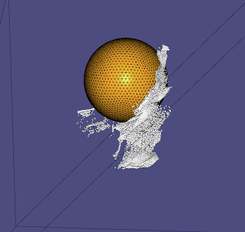
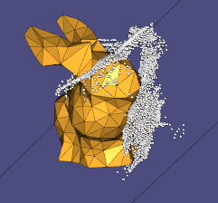

# Fluid Simulation: Smoke and Collision

This is a smoke simulation project. We used [libigl](http://libigl.github.io/libigl/) to render the simulation, 
and libigl and [Eigen](http://eigen.tuxfamily.org/index.php?title=Main_Page) to implement the smoke simulation behavior. 

## Demo
Smoke simulation colliding with a ball:


<br/>
<br/>

Smoke simulation colliding with a bunny:


<br/>
<br/>

Video demonstration and methodology: [here](https://youtu.be/lMkeVszKhB4)

## Methodology

Please refer to ```paper.pdf``` in this repository for details.

## Code Navigation

```main.cpp```
* Runs the smoke simulation
* Connects smoke simulation and renderer

```visualization.h```, ```visualization.cpp```
* Wrapper around libigl's simulation viewer

```simulation.h```
* Initializes simulation objects
* Manages simulation state variables
* Simulates smoke

```staggered_grid.h```, ```staggered_grid.cpp```
* Staggered grid, also known as Marker-and-Cell (MAC) grid.
* Discretization of the smoke box space is managed by this data structure
* Contains smoke simulation logic; e.g. external forces, pressure projection, advection, etc.

```grid.h```, ```grid.cpp```
* Data structure to hold grids of the staggered grid

Utilities
* ```grid_util.h```, ```grid_util.cpp```: helper functions related to grid management
* ```util.h```, ```util.c```: other helper functions

Other
* ```constants.h```: simulation options and tuning parameters for smoke simulation
* ```point.h```, ```point.cpp```: Point object used for ```Grid``` objects
* ```list3d.h```: 3D list object

## Simulation Options
Simulation options can be set in ```constants.h```. After making an edit, make sure to **rebuild** the 
project before running it again.

### Scenarios
You can customize different scenarios to simulate. Simply set the constants to match the appropriate scenario.

To simulate smoke only:
```
// external objects
const bool ball = false;
...
const bool bunny = false;
```

To simulate smoke and ball collision:
```
// external objects
const bool ball = true;
...
const bool bunny = false;
```

To simulate smoke and bunny collision:
```
const bool ball = false;
...
const bool bunny = true;
```

### Performance 
If the simulation is too slow, you can reduce the number of particles with the following constant:
```
// smoke particle count and initial location
const int PARTICLE_COUNT = 10000;
```

If the simulation is still slow, consider simulating without a bunny object.
Also consider using the following setting to display simplified smoke particles.
```
const bool useParticles = false;
```

## Setup

To clone the repository and its submodules: ```git clone --recursive https://github.com/MultiW/smoke-simulation.git```

The project can be found in: https://github.com/MultiW/smoke-simulation

### Dependencies
The only dependencies are stl, eigen, [libigl](http://libigl.github.io/libigl/) and
the dependencies of the `igl::opengl::glfw::Viewer`.

The cmake build system will attempt to find libigl according to environment variables (e.g., `LIBIGL`) and searching in common desitinations (e.g., `/usr/local/libigl/`). If you haven't installed libigl before, we recommend you to clone a copy of libigl right here:

    cd libigl-example-project/
    git clone https://github.com/libigl/libigl.git

C++11 or higher should be used.

### Compile
_Note: this project was only tested on Windows 10_

Compile this project using the standard cmake routine:

    mkdir build
    cd build
    cmake ..
    make

This should find and build the dependencies and create a `smoke-simulation.exe` binary.

More help with compilation can be found [here](http://libigl.github.io/libigl/tutorial/).

### Run
From within the `build` directory just issue:

    ./smoke-simulation.exe

A glfw app should launch displaying the simulation.

## Collaboration
James Bao and Xin Wang
